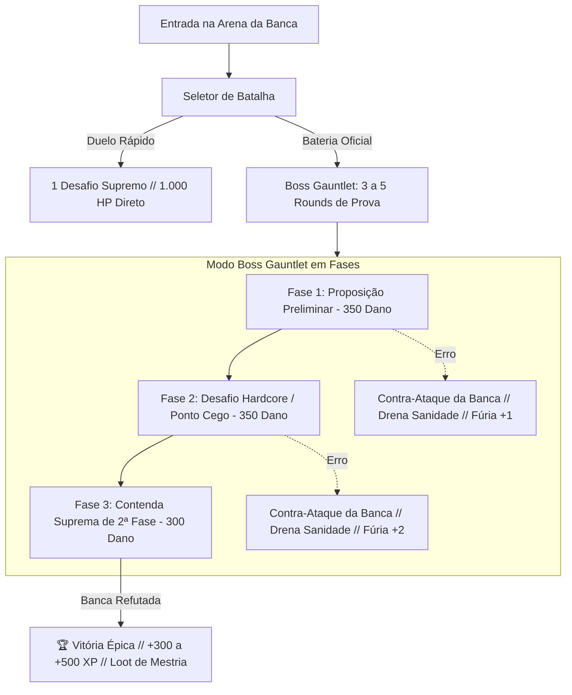

# Plano Estratégico: Expansão da Boss Fight & Integração do Acervo de Provas Oficiais

Transformar a **Boss Fight** em um dos **centros neurálgicos do MestreCard**, conectando a mecânica tática de combate em turnos ao gigantesco acervo de **588 PDFs de provas oficiais e gabaritos comentados** já presentes na pasta `Provas Oficiais e Exercícios`.

---

## 🏛️ 1. Diagnóstico do Acervo Existente (`Provas Oficiais e Exercícios`)

Após escanear minuciosamente a pasta, identificamos um acervo de altíssimo valor educacional dividido em dois grandes blocos:

### Bloco A: Provas Oficiais na Íntegra com Gabarito Comentado (588 PDFs)
- 🩺 **Albert Einstein - Medicina (2023, 2024)**: Provas objetivas e gabaritos comentados linha por linha.
- 🌐 **ENEM (2018 a 2024)**: Cadernos de prova oficiais dos Dias 1 e 2.
- 🏛️ **Bancas Paulistas & Estaduais de Elite**:
  - `UNESP (2023 a 2025)`
  - `UERJ`, `UEMA`, `UFG`, `UFT - EXATO`, `UECE`, `UEG`, `UNITINS`
- 🏥 **Vestibulares de Medicina Tradicionais**:
  - `UNIRG`, `UNIRV` (Gabaritos e provas de medicina de altíssima concorrência)
- 📚 **Simulados Separados (EXTRAS)**: Simulados temáticos, seriados e turnos.

### Bloco B: Acervo Especializado por Tópico (`extras/`)
- ⚗️ **Química**: Dezenas de listas temáticas especializadas cobrindo *Termoquímica*, *Eletroquímica e Eletrólise*, *Equilíbrio Iônico*, *Estequiometria*, *Funções Orgânicas*, *Isomeria*, *Ligações Químicas* e *Soluções*.
- 🧬 **Biologia**: 10 subpastas estruturadas (*Bioquímica*, *Citologia*, *Genética*, *Fisiologia Humana*, *Ecologia*, *Evolução*, *Embriologia*, *Biotecnologia*, *Botânica*, *Zoologia*).

---

## ⚔️ 2. Aprimoramento Geral da Boss Fight: O "Coliseu da Banca"

Para que a Boss Fight seja um dos centros da plataforma, ela deve evoluir de um embate estático de 1 questão para um **RPG Tático de Aprovação Multi-Fases**:



### Novas Mecânicas da Arena:
1. **Modo Gauntlet (3 Fases de Combate)**:
   - O Boss de 1.000 HP não tomba com apenas 1 pergunta. O aluno precisa encadear **3 golpes de tese** (3 rodadas) para zerar a barra de integridade do examinador.
   - Cada rodada traz uma questão real da banca. Acertos causam **350 de dano**; erros drenam a sanidade do aluno e ativam os contra-ataques procedurais.
2. **Identidade Dinâmica do Boss por Banca**:
   - 🩺 **"Auditoria Albert Einstein Medicina"**: Foco em rigor fisiológico e reações orgânicas aplicadas.
   - 🏛️ **"Tribunal Central UNESP / FUVEST"**: Foco em deduções matemáticas limpas e leis físicas.
   - 🌐 **"Examinador de Habilidades ENEM"**: Distratores de leitura de gráficos e contexto social.
3. **Deck de Habilidades Expandido (Gasto de PA)**:
   - 🛡️ **Escudo Mnemônico (-1 PA)**: Vaporiza 1 distrator incorreto do tabuleiro.
   - 📜 **Oráculo de Foco (-2 PA)**: Descriptografa a fraqueza axiomática da banca.
   - ⚡ **Regeneração de PA**: Cada acerto perfeito consecutivo sem usar dicas restaura +1 PA.

---

## 📁 3. Plano de Reorganização e Catalogação da Pasta

Propomos padronizar a pasta `Provas Oficiais e Exercícios` em uma taxonomia modular em 3 níveis, criando um arquivo índice `CATALOGO_DO_ACERVO.md`:

```
Provas Oficiais e Exercícios/
├── 01 - Por Matéria (Listas Temáticas para MestreCards e Treinamento)/
│   ├── Biologia/ (Bioquímica, Citologia, Fisiologia, Genética, Ecologia...)
│   ├── Química/ (Termoquímica, Eletroquímica, Orgânica, Estequiometria...)
│   ├── Física/ (Mecânica, Termologia, Eletromagnetismo, Óptica...)
│   ├── Matemática/ (Álgebra, Geometria, Funções, Probabilidade...)
│   └── Humanas e Linguagens/
├── 02 - Por Banca (Provas na Íntegra e Gabaritos Comentados)/
│   ├── Medicina Albert Einstein/ (2023, 2024...)
│   ├── ENEM/ (2018 a 2024...)
│   ├── UNESP & Paulistas/
│   ├── Federais e Estaduais/ (UERJ, UEMA, UFG, UFT, UECE, UNITINS...)
│   └── Tradicionais Medicina/ (UNIRG, UNIRV...)
└── 03 - Simulados e Revisões Gerais/
```

---

## 🔄 4. Como Conectar o Acervo de Provas à Boss Fight (Matchmaking Epistêmico)

Como as provas possuem gabarito comentado, podemos extrair as questões no formato JSON canônico do MestreCard:

```json
{
  "id": "einstein-2024-q18",
  "banca": "Albert Einstein",
  "ano": 2024,
  "materia": "quimica",
  "topico": "termoquimica",
  "enunciado": "...",
  "options": [
    { "letter": "A", "text": "...", "isCorrect": true },
    { "letter": "B", "text": "...", "isCorrect": false }
  ],
  "resolution": {
    "technicalVerdict": "Gabarito A. Resolução comentada...",
    "distractorAnalysis": "Alternativa B: Falácia por inversão de sinal..."
  }
}
```

### O Fluxo no Aplicativo:
1. Você abre o MestreCard de **Termoquímica (Lei de Hess)**.
2. Na Seção 05, você comuta para **Boss Fight Roguelike**.
3. Você escolhe o modo de batalha:
   - **[ ⚔️ Duelo do Dossiê ]**: Usa as questões calibradas do próprio card.
   - **[ 🏛️ Boss Raid das Bancas Oficiais ]**: O sistema busca no repositório de questões todas as questões catalogadas de *Termoquímica* das provas oficiais (Albert Einstein, ENEM, UNESP) e monta uma batalha de 3 rounds com questões reais comentadas!

---

## 🎯 Roteiro de Execução Proposto (Passo a Passo)

1. **Passo 1: Evolução do Motor do Boss Fight (`boss-engine.ts` e `LabSection.tsx`)**:
   - Implementar o suporte a **Multi-Rounds (Gauntlet)** com barra de 1.000 HP fracionada, seletor de duração da luta (1 round rápido vs 3 rounds de bateria) e transição de turnos.
2. **Passo 2: Organização da Pasta `Provas Oficiais e Exercícios`**:
   - Reestruturar as pastas em uma árvore taxonômica limpa e gerar o `CATALOGO_DO_ACERVO.md` listando todos os PDFs e as matérias/tópicos que cada um atende.
3. **Passo 3: Criador do Banco de Questões Oficiais**:
   - Criar a estrutura em `src/data/official-questions/` e importar um lote inicial de questões reais comentadas de química e biologia para conectar diretamente à arena.
